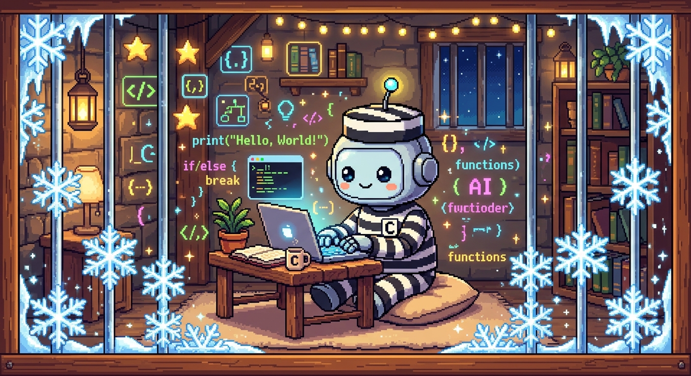

# 

Nix flake template for running [Claude Code](https://claude.com/claude-code) inside a [bubblewrap](https://github.com/containers/bubblewrap) sandbox using [jail.nix](https://sr.ht/~alexdavid/jail.nix/).

## Usage

```bash
nix develop   # shell with jailed claude-code available
nix build     # build the jailed wrapper script
```
